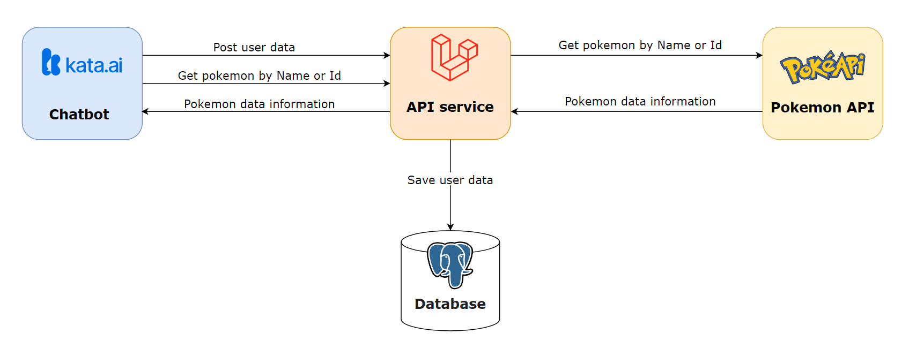

# Pokemon API

Pokemon API is a backend application that aims to connect the [Kata.ai](https://kata.ai/) chatbot with [Pokeapi](https://pokeapi.co/) to get information about Pokemon. This application is made by using [Laravel](https://laravel.com/) framework and [PostgreSQL](https://www.postgresql.org/) as database. Here's an overview for the application system. 



<hr>

## Installation
Before installation you should ensure that your local machine has PHP and [Composer](https://getcomposer.org/) installed. If you are developing on macOS, PHP and Composer can be installed via [Homebrew](https://brew.sh/). For more information please check this [link](https://laravel.com/docs/9.x).

- Clone this repository.
- Run <code>composer install</code>.
- Copy <b>example.env</b> and change it into <b>.env</b>.
- Create database.
- Edit variable <code>DB_CONNECTION</code>, <code>DB_HOST</code>, <code>DB_PORT</code>, <code>DB_DATABASE</code>, <code>DB_USERNAME</code>, <code>DB_PASSWORD</code> in <b>.env</b> file.
- Run <code>php artisan key:generate</code>.
- Run <code>php artisan migrate</code>.
- Run <code>php artisan serve</code>.

<hr>

## Installation with Docker
This project using [Laravel sail](https://laravel.com/docs/9.x/sail)  for interacting [Docker](https://www.docker.com/) development environment. Laravel Sail is supported on macOS, Linux, and Windows (via [WSL2](https://docs.microsoft.com/en-us/windows/wsl/about)).

- Clone this repository.
- Run the command bellow to install PHP and Composer application dependencies.
```
docker run --rm \
    -u "$(id -u):$(id -g)" \
    -v $(pwd):/var/www/html \
    -w /var/www/html \
    laravelsail/php81-composer:latest \
    composer install --ignore-platform-reqs
```
- Copy <b>example.env</b> and change it into <b>.env</b>.
- Edit variable <code>DB_CONNECTION</code>, <code>DB_HOST</code>, <code>DB_PORT</code>, <code>DB_DATABASE</code>, <code>DB_USERNAME</code>, <code>DB_PASSWORD</code> in <b>.env</b> file.
- Run <code>./vendor/bin/sail up</code>.
- Run <code>./vendor/bin/sail artisan key:generate</code>.
- Run <code>./vendor/bin/sail artisan migrate</code>.
